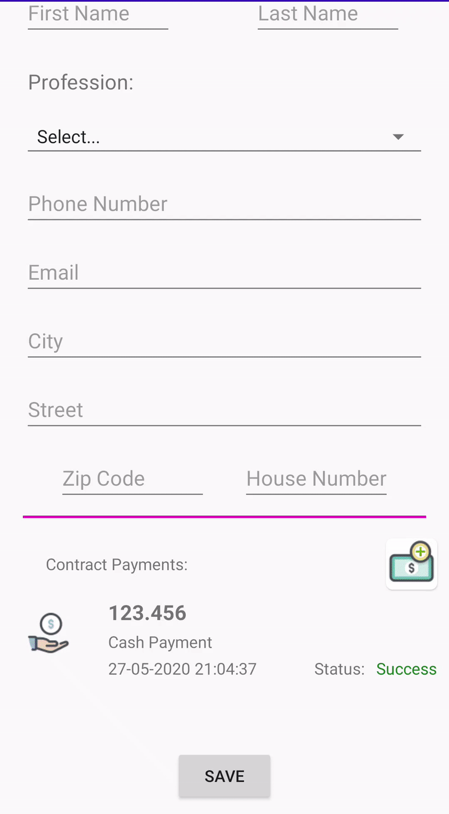

# Android UI Validator
A simple fields validator for Android that I created for checking mandatory fields.



## Setup
  1. Copy the code inside UIValidator.java file into a new class file inside your Android application and call it `UIValidator`.
  2. Replace the following line with your actual package name
      ```
      package YOUR_PACKAGE_NAME_HERE;
      ```
  3. Done
  
## Usage Example
  1. Create a global `List<View>` and call it `fieldsToBeValidated` (name doesn't matter)
  2. Inside onCreate method in your Activity (onViewCreated method in Fragment):
  <br />Initialize your `fieldsToBeValidated` list as you would initialize a `List<>`. for example:<br />
  ```
  fieldsToBeValidated = new ArrayList<>(Arrays.asList(
				firstNameTextView,
				lastNameTextView,
				phoneNumberTextView,
				emailTextView,
				professionIdSpinner,
				cityNameTextView,
				zipCodeTextView,
				streetTextView,
				houseNumberTextView));
  ```
  3. Use the `validateViewFields` method as follows
  ```
  if (!UIValidator.validateViewFields(fieldsToBeValidated, true)) {
      YOUR CODE HERE...
  }
  ```
## Notes
  1. The main method of this class is `validateViewFields`, but there are more methods that you can use on your own.
  2. `validateViewFields` takes two arguments, the first is the list of the views you want to validate, and the second is a boolean that applies visuals on the fields you want to validate. in other words, the boolean indicates setting red error on fields or not.
  3. The capabilities of `UIValidator` class are only for TextView (EditText as well) and Spinner views. it can be scaled to other view types, I just didn't need to for now.
  4. Default values for the validator are " " (empty string) for TextView, and " " (empty string) or "Select..." for Spinner, you can change those as you wish.
## Full Code Usage Example
  1. Activity:
  ```
    public class AddContractActivity extends AppCompatActivity {

      TextView contractDescriptionTextView;
      TextView totalAmountTextView;

      List<View> fieldsToBeValidated;

      @Override
      protected void onCreate(Bundle savedInstanceState) {
          super.onCreate(savedInstanceState);
          setContentView(R.layout.activity_add_contract);

          contractDescriptionTextView = findViewById(R.id.contractDescriptionEditText);
          totalAmountTextView = findViewById(R.id.totalAmountText);

          fieldsToBeValidated = new ArrayList<>(Arrays.asList(
                  contractDescriptionTextView,
                  totalAmountTextView));

          saveButton.setOnClickListener(new View.OnClickListener() {
              @Override
              public void onClick(View v) {
                  if (!UIValidator.validateViewFields(fieldsToBeValidated, true)) {
                      Toast.makeText(AddContractActivity.this, "Missing Fields", Toast.LENGTH_SHORT).show();
                      mainScrollView.post(new Runnable() {
                          @Override
                          public void run() {
                              mainScrollView.smoothScrollTo(0, 0);
                          }
                      });
                      return;
                  }
              });
          }
      }
  }
  ```
  2. Fragment:
  ```
    public class AddPersonFragment extends Fragment {

    TextView firstNameTextView;
    TextView lastNameTextView;
    TextView phoneNumberTextView;
    TextView emailTextView;
    Spinner professionIdSpinner;
    TextView cityNameTextView;
    TextView zipCodeTextView;
    TextView streetTextView;
    TextView houseNumberTextView;
	
    List<View> fieldsToBeValidated;
	
	@Override
    public void onViewCreated(@NonNull View view, @Nullable Bundle savedInstanceState) {
        super.onViewCreated(view, savedInstanceState);


        firstNameTextView = getView().findViewById(R.id.firstNameTextView);
        lastNameTextView = getView().findViewById(R.id.lastNameTextView);
        phoneNumberTextView = getView().findViewById(R.id.phoneNumberTextView);
        emailTextView = getView().findViewById(R.id.emailTextView);
        professionIdSpinner = getView().findViewById(R.id.professionIdSpinner);
        cityNameTextView = getView().findViewById(R.id.cityNameTextView);
        zipCodeTextView = getView().findViewById(R.id.zipCodeTextView);
        streetTextView = getView().findViewById(R.id.streetTextView);
        houseNumberTextView = getView().findViewById(R.id.houseNumberTextView);

        fieldsToBeValidated = new ArrayList<>(Arrays.asList(
                firstNameTextView,
                lastNameTextView,
                phoneNumberTextView,
                emailTextView,
                professionIdSpinner,
                cityNameTextView,
                zipCodeTextView,
                streetTextView,
                houseNumberTextView));
    }
	
	public Person getPersonFromFragment() {
        if (!UIValidator.validateViewFields(fieldsToBeValidated, true)) {
            return null;
        }

        Person person = new Person();

        person.firstName = firstNameTextView.getText().toString();
        person.lastName = lastNameTextView.getText().toString();
        person.contactInfo.phoneNumber = phoneNumberTextView.getText().toString();
        person.contactInfo.emailAddress = emailTextView.getText().toString();
        person.profession.name = professionIdSpinner.getSelectedItem().toString();
        person.contactInfo.address.city.name = cityNameTextView.getText().toString();
        person.contactInfo.address.zipCode = zipCodeTextView.getText().toString();
        person.contactInfo.address.street = streetTextView.getText().toString();
        person.contactInfo.address.number = houseNumberTextView.getText().toString();

        return person;
    }
}
  ```
